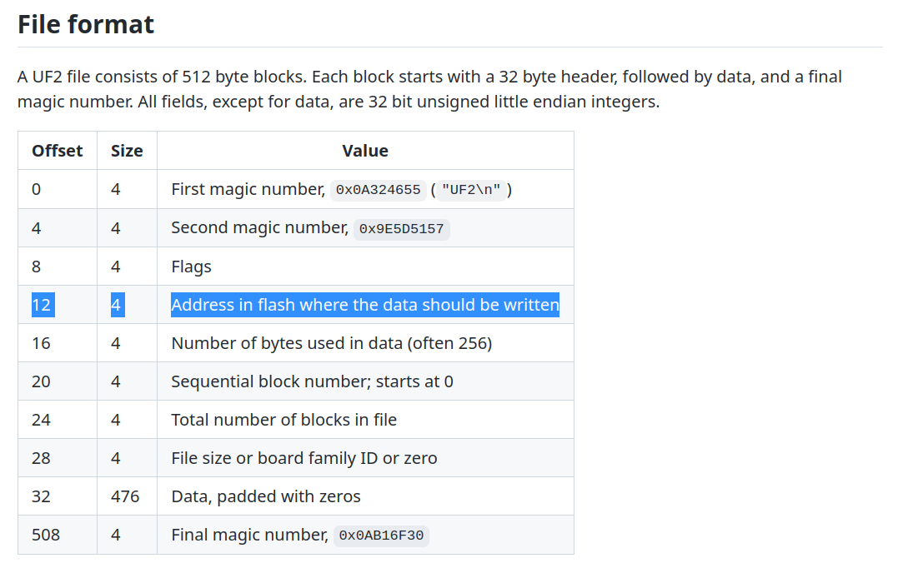
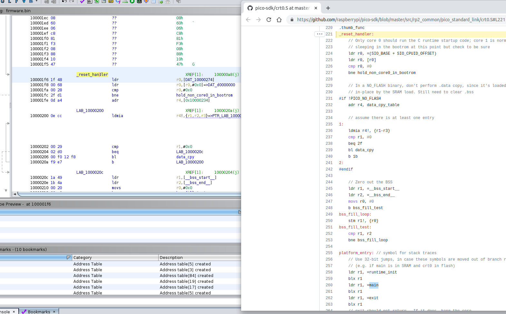

# Paper House
```
author:ptr-yudai

The Professor has successfully leaked the schematic and firmware of the safebox in the Paper House. Can you crack the password to open the vault door? 
The flag is SECCON{}.
i.e. If "1->2->A->B" is the key, the flag is "SECCON{12AB}".

paper_house.tar.gz 41aa3ec1be4eb7bcf338cdd7ed83e56c559827ab
```
問題は↓のシステム概要図のドアを開けるようなPmodKYPDのパスワードを求めるという問題でした。


配布の[safe.uf2](./files/work/safe.uf2)ファイルを[microsoft/uf2
](https://github.com/microsoft/uf2)で展開し[firmware.bin](./files/work/firmware.bin)を得ました。

uf2というファイルフォーマットについて知らなかったのでuf2のgithubリポジトリのreadmeを読むと、uf2ファイルは512byteごとにデータが分割管理されていて各512byteのブロックは以下のような`metaデータ + 476byteのプログラムデータ`という構造になってるそうです。
各ブロックの12byte目にはプログラムデータを書き込むアドレスが保存されており、展開後のfirmware.binは0x10000000に書き込まれると分かりました。





システム概要図に書いてあったraspberry pi picoについて調べると、picoはxipモードというモードで動作させると[flashメモリが0x10000000〜](https://datasheets.raspberrypi.com/rp2040/rp2040-datasheet.pdf#2.6.3.%20Flash)にマッピングされると書いてあったので、firmware.binはpicoのflashメモリに保存されるプログラムデータだとわかりました。

[Memory Map](https://datasheets.raspberrypi.com/rp2040/rp2040-datasheet.pdf#2.2.%20Address%20Map)を参考にして、firmware.binを↓のようにghidraにロードしました。


Ghidraの解析結果を眺めていると、firmware.binにはデバッグ情報が一部残っていて[raspberrypi/pico-sdk](https://github.com/raspberrypi/pico-sdk)を使って開発されたものだと分かります。
pico-sdkの実行フローは[この記事](https://qiita.com/yunkya2/items/5f0f5ebb0f26a52805d9#sdk%E3%81%B8%E3%82%B8%E3%83%A3%E3%83%B3%E3%83%97)が非常に参考になりました。

pico-sdkでは開発者がmain関数を定義できるようなので、main関数を特定します。
記事に
> 0x10000100 を新たなベクタテーブルとして設定し、MSPとPCの値を読んで実行を開始します。

とあるように、0x10000100にMSP, 0x10000104にPC(flashメモリ中の最初に実行されるアドレス)が保存されています。

0x10000104のアドレスには0x100001f7が保存されていたので、0x100001f7が[SDKのスタートアップコード(crt0.S)](https://github.com/raspberrypi/pico-sdk/blob/master/src/rp2_common/pico_standard_link/crt0.S#L221)と分かりました。
(↓の画像のように0x100001f6〜のコードの解析結果とcrt0.Sのソースコードが完全に一致。※ 0x100001f6〜コードはthumb命令のためアドレスが1ズレている。)




そして、crt0.Sでは[main関数のアドレスがロードされる](https://github.com/raspberrypi/pico-sdk/blob/master/src/rp2_common/pico_standard_link/crt0.S#L260)のでfirmware.binの該当部分(0x1000021eの命令)を見ると、main関数は0x100006c0と分かりました。

[picoのGPIOのアドレス](https://datasheets.raspberrypi.com/rp2040/rp2040-datasheet.pdf#2.3.1.%20SIO)などを情報を使ってmain関数の解析を行うと、[作問者のptr-yudai先生が説明されている](https://ptr-yudai.hatenablog.com/entry/2023/02/14/033354#Reversing-Paper-House)内容であることが分かったので、チームメイトにパスワードを求めていただきました。(雑)

`SECCON{86EDAB934986A125}`
